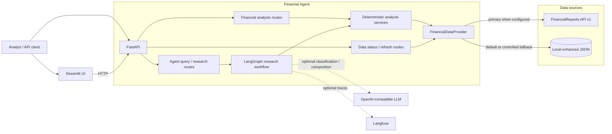
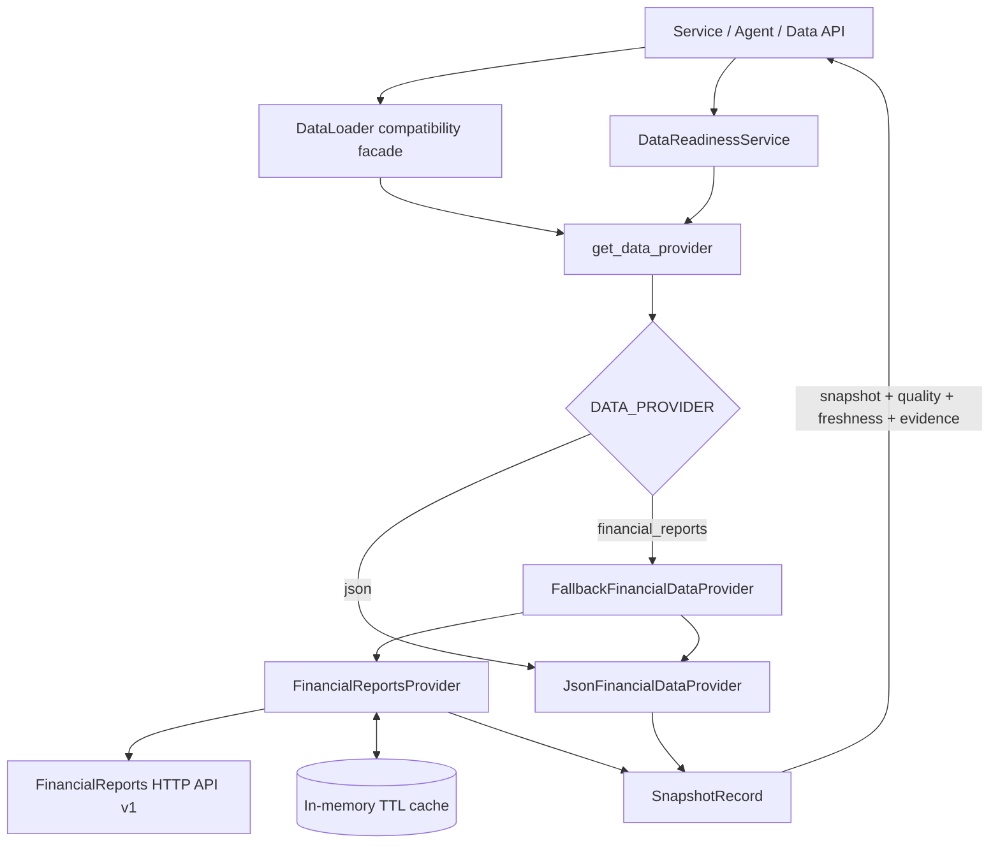

# Financial Agent Architecture

This document describes the implemented architecture of Financial Agent 2.0.
It is the source of truth for system boundaries, data access, and Agent
orchestration. Planned capabilities are listed separately in `SPEC.md`.

## System Architecture

### System Responsibilities

| Component | Owns | Does not own |
| --- | --- | --- |
| FinancialReports | Source acquisition, parsing, canonical facts, validation, quality, freshness, evidence | Investment conclusions and Agent orchestration |
| Financial Agent data layer | Provider selection, contract mapping, retry, cache, fallback, readiness | Parsing raw PDF/XBRL filings |
| Analysis services | Deterministic financial formulas and scores | Source acquisition or natural-language composition |
| LangGraph Agent | Intent, research planning, tool execution, contradiction checks, report composition | Recalculating financial facts inside the LLM |
| FastAPI | Stable HTTP boundary, status codes, thread-pool execution | Business formulas |
| Streamlit | Analyst interaction and visualization | Direct data/service access |

The UI always calls FastAPI. Financial Agent and FinancialReports communicate
through a versioned HTTP contract; they must not share a SQLite database file.
The LLM and Langfuse are optional. With no LLM key, deterministic routing and
report composition remain available.

## Data Layer Architecture

### Provider Contract

Every provider implements these operations:

- `load_record(stock_code, period)`
- `list_available_periods(stock_code)`
- `list_all_stocks()`
- `get_context(stock_code, period)`
- `request_refresh(stock_code, period)`
- `get_job(job_id)`

`SnapshotRecord` carries a normalized `FinancialSnapshot` plus source,
schema version, quality, freshness, evidence, metrics, events, and status.
The legacy `DataLoader` remains as a facade so analysis services keep a stable
interface while the source changes.

### Fallback and Status Rules

| Condition | Behavior |
| --- | --- |
| Remote transport error or HTTP 5xx | Retry, then use stale cache or JSON fallback when enabled |
| Remote HTTP 404 | Return missing; never hide it with unrelated local data |
| Remote HTTP 422 or invalid contract | Return a contract error; do not fallback |
| Cached record past TTL during outage | Return it with `freshness.is_stale=true` |
| Quality score below threshold | Readiness becomes `low_quality` and Agent confidence is reduced |
| Remote refresh accepted | Return HTTP 202 and expose the job through `/api/data/jobs/{job_id}` |
| JSON provider refresh requested | Return HTTP 503 because local files cannot enqueue ingestion |

FinancialReports must expose the six v1 endpoints documented in
`MODIFICATION_PLAN.md`. Until that service is deployed, `DATA_PROVIDER=json`
is the supported default.

## Agent Layer Architecture

```mermaid
flowchart TD
    UI[Streamlit Agent page]
    Client[API client]
    QueryRoute[POST /api/agent/query]
    ResearchRoute[POST /api/agent/research]
    ForceResearch[Force mode = research]
    ThreadPool[FastAPI thread pool]
    Init[Initialize AgentState and defaults]

    UI --> ResearchRoute
    Client --> QueryRoute
    Client --> ResearchRoute
    QueryRoute --> ThreadPool
    ResearchRoute --> ForceResearch --> ThreadPool
    ThreadPool --> Init

    subgraph Graph[LangGraph StateGraph]
        Intent[1. Intent router]
        HasLLM{LLM key configured?}
        LLMIntent[LLM classification and entity extraction]
        IntentOK{Classification succeeded?}
        Keyword[Deterministic keyword fallback]

        Ready[2. Data readiness]
        Management{Management intent?}
        NotRequired[Mark data not required and assumptions]
        ProviderCheck[Load readiness and source evidence]
        MissingRefresh{Missing and auto-refresh enabled?}
        Refresh[Request FinancialReports refresh and mark processing]

        Planner[3. Research planner]
        Broad{Research mode or broad question?}
        SinglePlan[Plan selected intent only]
        CorePlan[Plan snapshot, trend, earnings quality, ROIC/WACC, EWS]
        HasPeers{At least two peers?}
        PeerPlan[Add peer and factor tools]

        Executor[4. Research executor]
        Available{Data available?}
        ReadinessResult[Create missing or failed readiness ToolResult]
        NextTool[Select next planned tool]
        FieldGate{Required fields missing?}
        Insufficient[Create insufficient_data ToolResult]
        Invoke[Invoke typed tool over deterministic service]
        ToolOK{Tool completed?}
        Success[Store result and attach evidence]
        Failed[Normalize exception as failed ToolResult]
        More{More planned tools?}
        Review[Detect contradictions]
        Report[Build ResearchReport, verdict and confidence]

        Composer[5. Answer composer]
        Findings{Any successful findings?}
        NoData[Compose bilingual data-unavailable answer]
        ComposeLLM{LLM key configured?}
        LLMAnswer[Constrained LLM composition]
        FixedAnswer[Deterministic Traditional Chinese composition]

        Intent --> HasLLM
        HasLLM -->|no| Keyword
        HasLLM -->|yes| LLMIntent --> IntentOK
        IntentOK -->|yes| Ready
        IntentOK -->|no| Keyword
        Keyword --> Ready

        Ready --> Management
        Management -->|yes| NotRequired --> Planner
        Management -->|no| ProviderCheck --> MissingRefresh
        MissingRefresh -->|yes| Refresh --> Planner
        MissingRefresh -->|no| Planner

        Planner --> Broad
        Broad -->|no| SinglePlan --> Executor
        Broad -->|yes| CorePlan --> HasPeers
        HasPeers -->|yes| PeerPlan --> Executor
        HasPeers -->|no| Executor

        Executor --> Available
        Available -->|no| ReadinessResult --> Review
        Available -->|yes| NextTool --> FieldGate
        FieldGate -->|yes| Insufficient --> More
        FieldGate -->|no| Invoke --> ToolOK
        ToolOK -->|yes| Success --> More
        ToolOK -->|no| Failed --> More
        More -->|yes| NextTool
        More -->|no| Review --> Report --> Composer

        Composer --> Findings
        Findings -->|no| NoData
        Findings -->|yes| ComposeLLM
        ComposeLLM -->|yes| LLMAnswer
        ComposeLLM -->|no| FixedAnswer
    end

    Init --> Intent
    NoData --> Response[AgentResponse]
    LLMAnswer --> Response
    FixedAnswer --> Response
    Response --> Output[UI or API client]
```

### Agent Implementation Map

| Flow stage | Implementation | State produced |
| --- | --- | --- |
| API entry | `app/api/agent.py` | `/query` preserves mode; `/research` forces `research` |
| State initialization | `FinancialAgent.query` | Query, stock, period, mode, context, and empty result collections |
| Intent routing | `_intent_router_node` | Intent and extracted entities; keyword fallback on missing key or LLM error |
| Data readiness | `_data_readiness_node` | Availability, status, quality, freshness warnings, evidence, and optional job ID |
| Planning | `_research_planner_node` | Deduplicated ordered `research_plan` |
| Tool execution | `_research_executor_node` | One normalized `ToolResult` per planned tool |
| Cross-tool review | `_detect_contradictions` | Contradiction messages for supported rule combinations |
| Report assembly | `_build_research_report` | Verdict, thesis, findings, evidence, risks, gaps, watch items, confidence |
| Answer composition | `_answer_composer_node` | Evidence-constrained LLM text or deterministic Traditional Chinese text |
| Public response | `FinancialAgent.query` | `AgentResponse` plus low/medium/high confidence label |

The executor handles tools sequentially in plan order. A blocked or failed tool
does not terminate the remaining plan: it becomes an `insufficient_data` or
`failed` result and the report records the resulting gap. Confidence starts
from the mean of successful tool confidence values, is multiplied by source
quality when available, and receives a further penalty when data gaps remain.

### Agent Execution Modes

| Mode | Planning behavior |
| --- | --- |
| `quick` | Run only the tool selected by intent |
| `auto` | Run one tool unless the query is a broad investment question |
| `research` | Run snapshot, trend, earnings quality, ROIC/WACC, and EWS; add peer and factor tools when peers are supplied |

Each tool returns the same `ToolResult` contract: status, finding, structured
data, evidence, warnings, missing fields, assumptions, confidence, and error.
Sentiment and guidance explicitly return `not_supported`; they never fabricate
a neutral result.

The final `ResearchReport` contains verdict, thesis, findings, evidence, risks,
contradictions, data gaps, watch items, and numeric confidence. The LLM may
phrase this report, but it receives the structured report and is not the source
of financial calculations.

## Runtime and Failure Boundaries

- FastAPI runs synchronous service and graph work in a thread pool.
- `/health/live` checks the process; `/health/ready` checks the configured data
  provider.
- Missing data uses structured 404/422 responses rather than generic 500s.
- Provider cache is process-local and is not shared across API workers.
- There is no authentication, durable job store, Redis, PostgreSQL, vector
  database, or multi-agent debate runtime in the current implementation.
- Financial analysis is decision support, not an autonomous trading system.

## Verification

The implemented boundary is covered by provider, readiness, tool-contract,
workflow, service, and API tests. GitNexus is used to re-index the repository,
check circular imports, and inspect cross-layer impact after structural changes.
