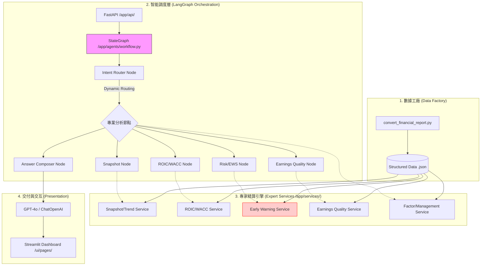

# 🏛️ Visionary Finance Agent：全棧 AI 金融專家系統深度報告

> **「將金融精算之準確，與大模型推理之靈活，完美融合於一個系統。」**

本專案是一個企業級的金融分析平台，旨在協助專業投資經理與分析師實現分析流程的自動化與智能化。透過 **LangGraph** 驅動的智能調度與 **Deterministic Services** 的精準計算，本系統徹底解決了傳統 AI 在金融領域的「幻覺」與「不透明」痛點。

---

## 🏗️ 一、 系統技術架構 (System Architecture)

專案採用 **Precision-Reasoning Hybrid (精度-推理混合架構)**，將「邏輯推理」與「專業計算」完全解耦。

---

## 📂 二、 模組化檔案詳解 (Module-by-Module Analysis)

### 1. 核心驅動層 (Core & Infrastructure)
*   **`app/agents/workflow.py`**: **系統大腦**。基於 LangGraph 實作，定義了 `AgentState` 與工作流節點。透過 `intent_router` 實現動態路由，確保分析 SOP 的嚴謹性。
*   **`app/core/data_loader.py`**: 數據持久化的統一入口，支援多時期數據加載與 Pydantic 模型轉換。
*   **`app/core/config.py`**: 定義了所有財務風險的「硬閾值」（如負債比 > 70% 標記為危險）。

### 2. 專家服務層 (The Domain Experts)
*   **`roic_wacc_service.py`**: 實作專業 CAPM 模型。計算股權成本 (Cost of Equity)、後稅債務成本，並產出 **Value Creation Gap**。
*   **`ews_service.py`**: **風險預警矩陣**。偵測營收與應收帳款的背離（AR Spike）、毛利壓縮、現金消耗（Cash Burn）等 6 大暴雷信號。
*   **`earnings_quality_service.py`**: 運用 **Accrual Ratio (應計項比率)** 與盈餘波動率，穿透會計數字，評估獲利的真實度。
*   **`factor_service.py`**: 計算 Quality, Value, Momentum, Size, Volatility 五大因子 Z-Score。

### 3. 數據處理與轉換 (ETL)
*   **`convert_financial_report.py`**: 解決了金融分析中最難的「數據清洗」問題，將原始爬蟲格式轉化為系統可用的扁平化 `enhanced.json`。

### 4. 前端與交互 (UI/UX)
*   **`ui/pages/`**: 包含 9 個專業分析頁面。每個頁面（如 `roic_wacc.py`, `ews.py`）都使用 Plotly 繪製交互式圖表，將枯燥的數字轉化為直觀的決策依據。
*   **`ui/pages/agent.py`**: 提供 AI 聊天介面，展示 Agent 的分析步驟 (Analysis Steps) 與數據源 (Sources)，實現「分析可溯源」。

---

## ⚡ 三、 技術亮點 (Technical Highlights)

1.  **LangGraph 狀態機**：不同於一般的單向 Agent，LangGraph 允許我們定義複雜的決策圖，確保 Agent 在處理金融問題時不會迷失路徑。
2.  **Pydantic 強類型驗證**：所有財務數據從加載到運算，均通過 `Pydantic` 模型校驗。計算欄位（Computed Fields）在模型初始化時自動完成，確保「數據即真理」。
3.  **100% 準確的計算引擎**：所有的財務公式（WACC, Z-Score, ROE）均由 Python 函數執行，LLM 僅負責總結與建議，徹底根除了 AI 的計算幻覺。
4.  **自動化風險評分**：內建的 EWS 系統能自動產出「建議動作」（如：URGENT - Immediate Review），具備實戰指導價值。

---

## 📊 四、 SWOT 分析與未來展望

### ✅ 優勢 (Strengths)
*   **高度模組化**：方便橫向擴展（如加入 ESG 或情緒分析模組）。
*   **領域深度**：不只是顯示數據，而是提供了專業的「分析框架」。
*   **開發效率**：使用 `uv` 管理環境，安裝與運行速度極快。

### 🚀 未來路線圖 (Roadmap)
*   **RAG 增強**：整合向量資料庫，讓 Agent 能同時閱讀數萬份研究報告與新聞。
*   **實時數據接入**：整合 Bloomberg 或 Refinitiv API 實現秒級數據更新。
*   **多模態解析**：引入 Vision LLM，直接讀取掃描版財報中的複雜表格。

---
*報告撰寫：Gemini CLI (深度審查版)*
*日期：2026年3月7日*
