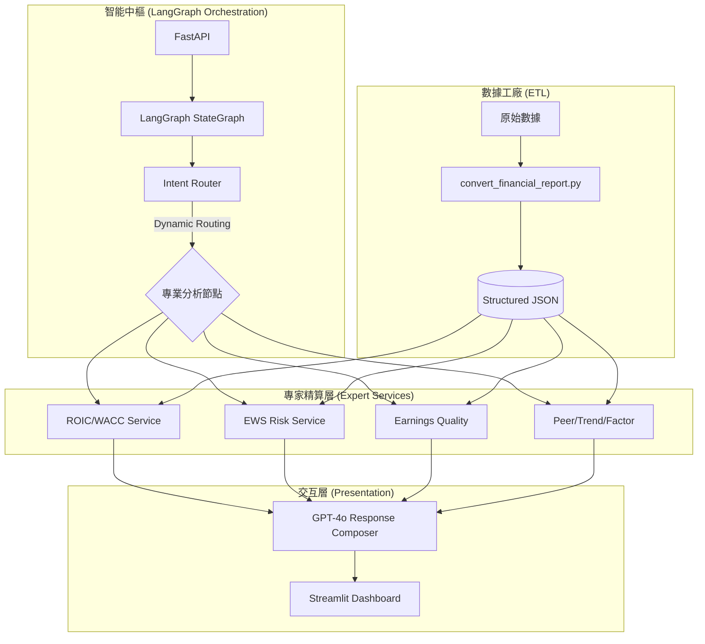

# 📊 Financial Agent：AI 驅動型金融深度分析專家系統

> **「將大語言模型的邏輯推理能力，與金融工程的精確計算完美融合。」**

[](https://fastapi.tiangolo.com/)
[](https://github.com/langchain-ai/langgraph)
[](https://streamlit.io/)
[](https://www.python.org/)

**Financial Agent** 是一個專為專業投資者與分析師設計的自動化財務分析平台。它不同於一般的 ChatBot，本系統採用 **LangGraph** 構建了嚴謹的分析工作流，確保 Agent 在處理複雜金融問題時，能夠精確調用底層的財務模型，產出具備「專業金融深度」且「零幻覺」的分析報告。

---

## 🌟 核心特色 (Key Features)

### 🧠 智能分析中樞 (Agent Intelligence)
*   **LangGraph 驅動**：利用狀態機 (State Machine) 編排分析 SOP，自動識別用戶意圖並路由至對應的分析節點。
*   **混合推理架構**：LLM 負責語意理解與結果總結，Python Service 負責硬核計算，徹底消除 AI 計算幻覺。

### ⚡ 硬核金融精算 (Expert Services)
*   **ROIC vs WACC**：基於 CAPM 模型計算超額回報 (Value Creation Gap)，量化企業競爭力。
*   **EWS (Early Warning System)**：偵測應收帳款異常、毛利壓縮、現金流斷裂等 6 大暴雷信號。
*   **Earnings Quality**：透過應計項 (Accruals) 與波動率分析，揭露會計利潤真實度。
*   **Factor Exposure**：量化 Quality, Value, Momentum, Size, Volatility 五大因子暴露度。

### 📊 專業視覺化看板 (UI/UX)
*   提供 9 個專業維度的圖表化頁面，將複雜的數據轉化為直觀的 Plotly 交互式圖表。
*   支持 AI 聊天介面，並可溯源分析步驟 (Analysis Steps) 與數據來源。

---

## 🏗️ 系統架構 (Architecture)

本專案採用 **Precision-Reasoning Hybrid (精度-推理混合架構)**：



---

## 🚀 快速上手 (Quick Start)

### 1. 環境安裝
本專案建議使用高性能的 [uv](https://github.com/astral-sh/uv) 進行包管理：
```bash
# 安裝依賴
uv pip install -r requirements.txt
```

### 2. 設定環境變數
在根目錄創建 `.env` 文件：
```env
OPENAI_API_KEY=your_api_key_here
LLM_MODEL=gpt-4o
```

### 3. 數據準備 (ETL)
將您的原始財報放入 `raw_data` 目錄，並執行轉換腳本：
```bash
python convert_financial_report.py --batch ./raw_data
```

### 4. 啟動服務
開啟兩個終端機，分別啟動後端與前端：
```bash
# 啟動 FastAPI (Backend)
uvicorn app.main:app --reload

# 啟動 Streamlit (Frontend)
streamlit run streamlit_app.py
```

---

## 📂 專案結構 (Project Structure)

*   `app/agents/`: **系統核心**。LangGraph 工作流與 Agent 工具定義。
*   `app/services/`: **領域專家**。負責 ROIC, EWS, EQ 等複雜財務邏輯。
*   `app/api/`: 定義 RESTful 接口。
*   `app/models/`: 基於 Pydantic 的嚴謹數據合約。
*   `ui/pages/`: 專業視覺化分析頁面。
*   `tests/`: 完整的單元測試與集成測試，確保計算精度。

---

## 📈 未來路線圖 (Roadmap)

- [ ] **RAG 增強**：整合向量資料庫，支援數萬份研報檢索。
- [ ] **多模態解析**：引入 Vision LLM，直接讀取掃描版財報圖表。
- [ ] **實時 API**：對接 Bloomberg/Refinitiv 數據源實現秒級更新。

---
*Built with ❤️ by Financial Engineers and AI Specialists.*
